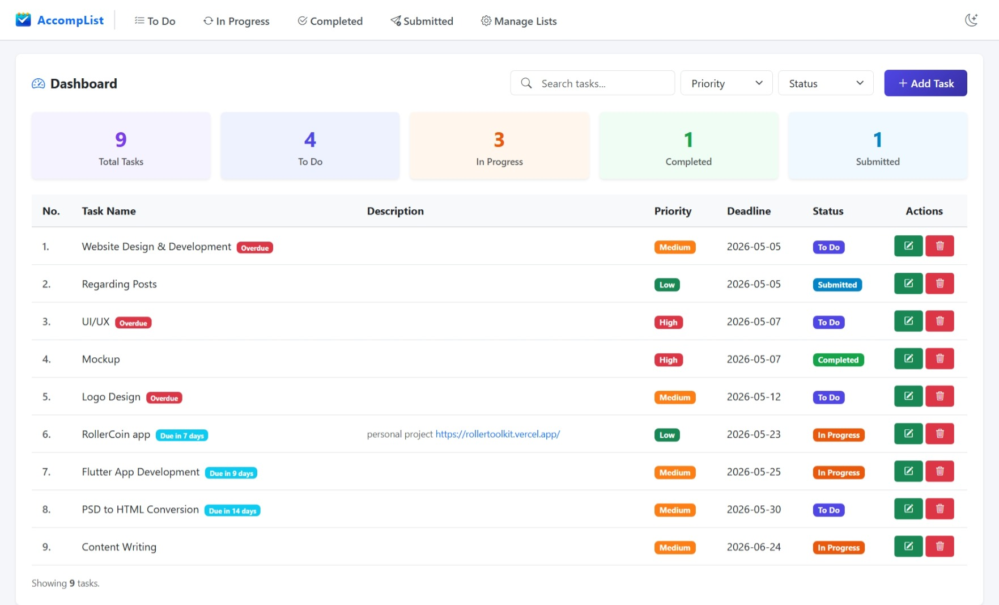
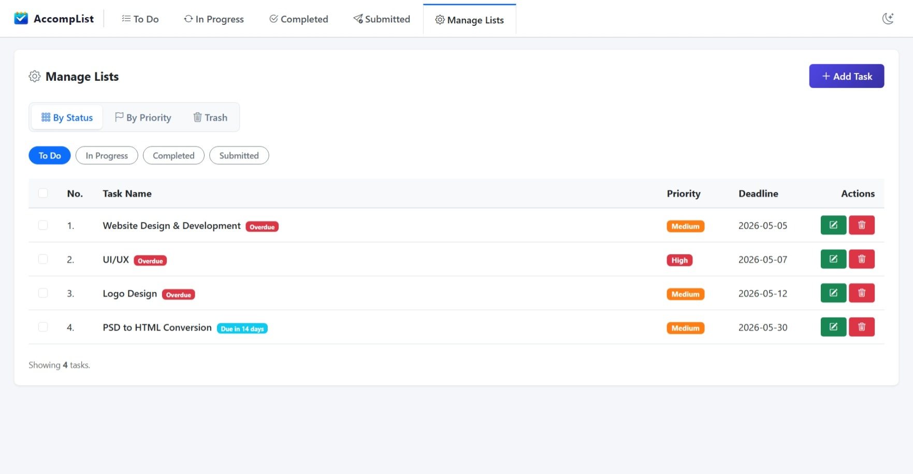
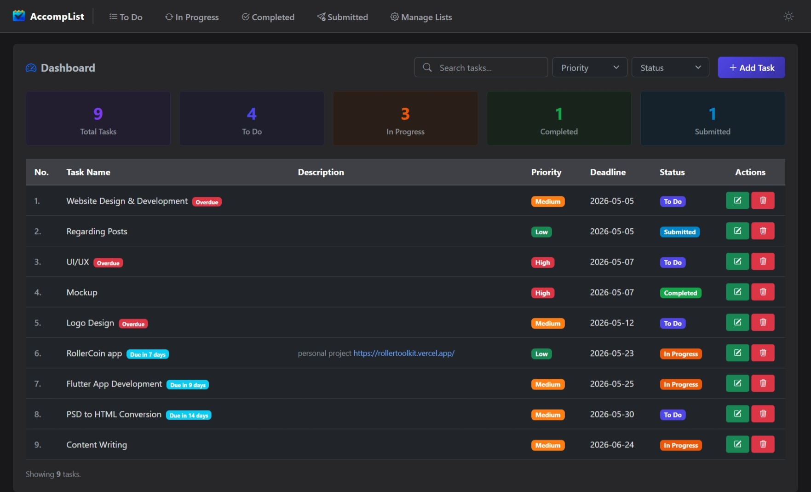

# AccompList 📝

AccompList is a streamlined task management application built with Laravel, designed to provide a clean and intuitive user experience. It helps you organize your daily workflow through a modern dashboard, category-based management, and smart deadline tracking—all within a responsive interface that supports both light and dark modes.

## ✨ Features

- **📊 Dashboard**: Real-time summary cards and a comprehensive task list.
- **🛡️ Privacy-First**: Anonymous user tracking via secure UUID cookies—no login or personal data required.
- **📱 Mobile Optimized**: Swipable navigation tabs and optimized table layouts for a seamless mobile experience.
- **🌙 Dark Mode**: Support for a dark theme that persists across your sessions.
- **⚡ Quick Management**: Add and update tasks instantly using modals without page reloads.
- **📂 Advanced Organization**: Filter and manage tasks by Status, Priority, or Trash via a dedicated management hub.
- **🧹 Bulk Actions**: Multi-select tasks to move them to trash, restore them, or delete them permanently in one go.
- **🚨 Smart Deadlines**: Color-coded badges for Overdue (Red), Urgent (Yellow, <3 days), and Upcoming (Blue) tasks.
- **🔍 Intelligent Search**: Dynamic search and filtering that narrows down tasks as you type.
- **🔗 Smart Descriptions**: Auto-detects links in task descriptions and makes them clickable.

## 📸 Preview
### Dashboard


### Management Hub


### Dark Mode


## 🛠️ Tech Stack

- **Framework**: Laravel (PHP)
- **Frontend**: Bootstrap 5 + Custom CSS
- **Icons**: Bootstrap Icons
- **Database**: MySQL / SQLite
- **Persistence**: JavaScript LocalStorage (for theme preference)

## 🚀 Setup Instructions

1. **Clone the project**
   ```bash
   git clone https://github.com/your-username/AccompList.git
   cd AccompList
   ```

2. **Install dependencies**
   ```bash
   composer install
   npm install && npm run dev
   ```

3. **Configure Environment**
   ```bash
   cp .env.example .env
   php artisan key:generate
   ```

4. **Migration & Seeding**
   ```bash
   php artisan migrate --seed
   ```

5. **Start the Server**
   ```bash
   php artisan serve
   ```

---

*Organize your tasks with simplicity.*
